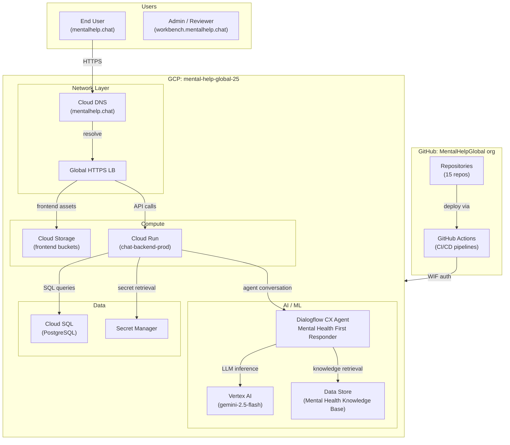

# Comprehensive System Architecture

**What this is:** A solution-level architecture description for the MentalHelpGlobal production system. It explains how components connect, how data flows, and what the conversational agent depends on. For the operational inventory of access points, roles, and resources, see [Access Audit — GCP + GitHub Inventory](https://mentalhelpglobal.atlassian.net/wiki/spaces/UD/pages/65470465).

**Scope:** Production environment only (`mental-help-global-25`). Dev environment is mentioned only for contrast.

---

## System at a Glance

---

## Pages in This Subtree

| # | Page | Description |
|---|---|---|
| 1 | [Repositories & Services Inventory](#1-repositories--services-inventory) | GitHub repos mapped to runtime services and CI/CD chains |
| 2 | [Production Network Topology](#2-production-network-topology) | DNS, GCLB, backends, SSL — how traffic enters the system |
| 3 | [Conversational Agent Architecture](#3-conversational-agent-architecture) | Dialogflow CX agent structure, playbooks, intents, dependencies |
| 4 | [GCP Infrastructure Inventory](#4-gcp-infrastructure-inventory) | Cloud Run, GCS, Cloud SQL, Secret Manager, Artifact Registry |
| 5 | [Data Flow & Integration Map](#5-data-flow--integration-map) | End-to-end request and conversation flows |
| 6 | [Component Functional Descriptions](#6-component-functional-descriptions) | What each element does, its purpose, and its consumers |
| 7 | [Database Schema Reference](#7-database-schema-reference) | Table map, field types, relationships, ERD |

---

## Environment Summary

| Environment | Frontend | API | GCP Project | Dialogflow Agent |
|---|---|---|---|---|
| Production | https://mentalhelp.chat | https://api.mentalhelp.chat | mental-help-global-25 | projects/mental-help-global-25/locations/global/agents/192578e5-f119-436e-9718-abb9d9d1c8b1 |

---

## How to Use This Subtree

1. **Start with the page that answers your question.** Each page is self-contained.
2. **Follow cross-references.** "See Page 4" links connect related topics.
3. **Check the "Last Verified" footer.** Every page shows when it was last updated and how to regenerate it.
4. **Verify freshness.** Run the command in the footer and diff against the page content.

---

## Relationship to Access Audit (062)

| This Subtree (063) | Access Audit (062) |
|---|---|
| How components connect | What exists and who can access it |
| Architecture diagrams | Operational inventory tables |
| Data flows and dependencies | IAM roles, secrets, service accounts |
| For understanding the system | For operating the system |

---

**Last Verified:** 2026-05-08 by Taras Bobrovytskyi
**Regeneration:** `gh repo list MentalHelpGlobal --limit 100 --json name`
