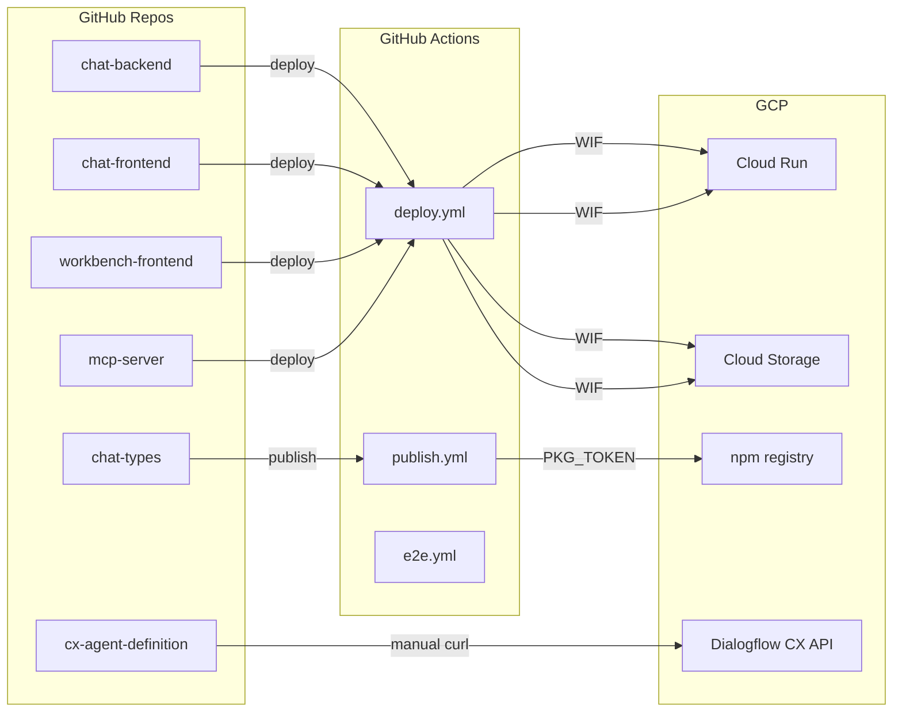

# 1. Repositories & Services Inventory

**What this is:** A mapping of every MentalHelpGlobal repository to its runtime service, deployment target, and CI/CD pipeline.

---

## Repository Catalog

| Repository | Purpose | Default Branch | Deploy Target | CI/CD Chain | Key Secrets | Packages Published |
|---|---|---|---|---|---|---|
| chat-backend | Express API, business logic, Dialogflow CX integration | develop | Cloud Run: chat-backend-prod | .github/workflows/deploy.yml | PKG_TOKEN, REDIS_HOST, REDIS_PORT | — |
| workbench-frontend | MHG Workbench frontend for admin, review, and management | develop | GCS: workbench-frontend-prod | .github/workflows/deploy.yml | PKG_TOKEN | — |
| cx-agent-definition | Dialogflow CX Agent configuration as code | main | Dialogflow CX API (manual deploy) | — (manual) | — | — |
| client-spec | Central repo for specification-driven development | main | — | — | — | — |
| mcp-server | MCP SSE server exposing MHG Workbench tools over Model Context Protocol | main | Cloud Run: mcp-server-prod | .github/workflows/deploy.yml | — | — |
| transcribe-poc | STT + Speaker Diarization POC — Ukrainian/Russian dialog transcription on GKE | main | GKE (POC only) | .github/workflows/deploy.yml | — | — |
| chat-types | Shared TypeScript types for MHG chat applications | main | npm registry (@mentalhelpglobal) | .github/workflows/publish.yml | NPM_TOKEN, PKG_TOKEN | @mentalhelpglobal/chat-types |
| chat-ui | Playwright E2E test suite | develop | — (runs on CI) | .github/workflows/e2e.yml | — | — |
| chat-frontend-common | Shared UI components, auth, i18n, and utilities for MHG frontend | develop | npm registry | .github/workflows/publish.yml | NPM_TOKEN, PKG_TOKEN | @mentalhelpglobal/chat-frontend-common |
| chat-infra | Infrastructure scripts and Terraform scaffolding | develop | — | — | — | — |
| chat-frontend | React SPA — user-facing chat interface | develop | GCS: chat-frontend-prod | .github/workflows/deploy.yml | PKG_TOKEN | — |
| delivery-workbench-backend | Express.js backend API + Worker for Delivery Workbench | main | Cloud Run: delivery-workbench-backend-prod | .github/workflows/deploy.yml | — | — |
| delivery-workbench-frontend | React SPA frontend for Delivery Workbench | main | GCS: delivery-workbench-frontend-prod | .github/workflows/deploy.yml | — | — |
| chat-ci | Reusable GitHub Actions workflows | main | — (called by other repos) | — | — | — |
| chat-client | Legacy monorepo (being phased out) | main | — | — | — | — |

---

## Deployment Map

---

## Cross-Reference: Repo → GCP Resource

| If you change this repo... | These GCP resources are affected |
|---|---|
| chat-backend | Cloud Run: chat-backend-prod |
| chat-frontend | Cloud Storage: chat-frontend-prod |
| workbench-frontend | Cloud Storage: workbench-frontend-prod |
| chat-types | npm registry, all repos depending on chat-types |
| cx-agent-definition | Dialogflow CX agent (manual redeploy required) |
| mcp-server | Cloud Run: mcp-server-prod |
| delivery-workbench-backend | Cloud Run: delivery-workbench-backend-prod |
| delivery-workbench-frontend | Cloud Storage: delivery-workbench-frontend-prod |

---

**Last Verified:** 2026-05-08 by Taras Bobrovytskyi
**Regeneration:** `gh repo list MentalHelpGlobal --limit 100 --json name,description,defaultBranchRef,updatedAt`
