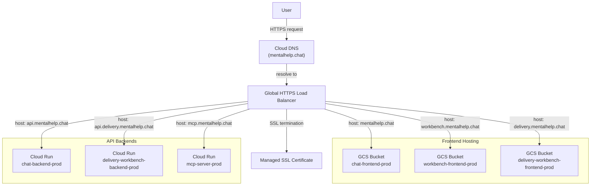

# 2. Production Network Topology

**What this is:** How user traffic enters the system, how it is routed, and where it terminates.

---

## Ingress Flow

---

## Domain Mapping

| Canonical URL | Purpose | Backend Type | Backend Resource |
|---|---|---|---|
| https://mentalhelp.chat | Chat frontend | GCS Bucket | chat-frontend-prod |
| https://workbench.mentalhelp.chat | Workbench frontend | GCS Bucket | workbench-frontend-prod |
| https://delivery.mentalhelp.chat | Delivery workbench frontend | GCS Bucket | delivery-workbench-frontend-prod |
| https://api.mentalhelp.chat | Chat backend API | Cloud Run | chat-backend-prod |
| https://api.delivery.mentalhelp.chat | Delivery backend API | Cloud Run | delivery-workbench-backend-prod |
| https://mcp.mentalhelp.chat | MCP server | Cloud Run | mcp-server-prod |

---

## DNS Configuration

| Domain | Type | Purpose |
|---|---|---|
| mentalhelp.chat | A / CNAME | Primary domain — resolves to GCLB frontend IP |
| *.mentalhelp.chat | CNAME | Wildcard for subdomains |

---

**Last Verified:** 2026-05-08 by Taras Bobrovytskyi
**Regeneration:** `gcloud dns record-sets list --zone=mentalhelp-chat --project mental-help-global-25` (requires gcloud auth)
