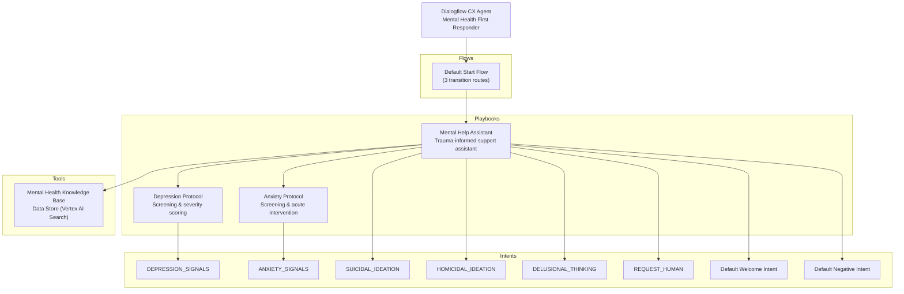
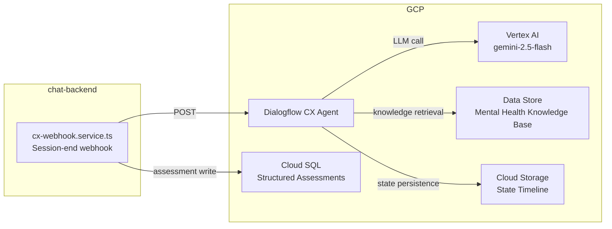

# 3. Conversational Agent Architecture

**What this is:** The Dialogflow CX agent's internal structure and its external dependencies.

---

## Agent Overview

| Property | Value |
|---|---|
| Agent ID | `projects/mental-help-global-25/locations/global/agents/192578e5-f119-436e-9718-abb9d9d1c8b1` |
| Display Name | Mental Health First Responder |
| Default Language | uk (Ukrainian) |
| Time Zone | Europe/Kaliningrad |
| LLM Backend | gemini-2.5-flash (via Dialogflow CX generative settings) |
| Safety Settings | `BLOCK_NONE` for clinical mission (DANGEROUS_CONTENT, HARASSMENT, HATE_SPEECH, SEXUALLY_EXPLICIT_CONTENT) |
| Deployment Method | REST API only (not "Restore from Git") |
| Source Repository | `MentalHelpGlobal/cx-agent-definition` (branch: `main`) |

---

## Agent Structure

---

## Resource Inventory

| Resource Type | Name | Display Name | Purpose |
|---|---|---|---|
| Playbook | Mental Help Assistant | Mental Help Assistant | Trauma-informed support assistant |
| Playbook | Depression Protocol | Depression Protocol | Depression screening & severity scoring |
| Playbook | Anxiety Protocol | Anxiety Protocol | Anxiety screening & acute intervention |
| Intent | DEPRESSION_SIGNALS | DEPRESSION_SIGNALS | Detects depression signals (0 params) |
| Intent | ANXIETY_SIGNALS | ANXIETY_SIGNALS | Detects anxiety signals (0 params) |
| Intent | SUICIDAL_IDEATION | SUICIDAL_IDEATION | Crisis detection (2 params) |
| Intent | HOMICIDAL_IDEATION | HOMICIDAL_IDEATION | Crisis detection (2 params) |
| Intent | DELUSIONAL_THINKING | DELUSIONAL_THINKING | Crisis detection (2 params) |
| Intent | REQUEST_HUMAN | REQUEST_HUMAN | Handoff request (2 params) |
| Intent | Default Welcome Intent | Default Welcome Intent | Greeting (0 params) |
| Intent | Default Negative Intent | Default Negative Intent | Fallback (0 params) |
| Flow | Default Start Flow | Default Start Flow | Entry point with 3 transition routes |
| Tool | Mental Health Knowledge Base | Mental Health Knowledge Base | Data Store containing protocols and knowledge |

---

## External Dependencies

---

## Configuration Sources

| What the agent needs | Where it comes from | How it's deployed |
|---|---|---|
| Playbook instructions | `cx-agent-definition` repo, `playbooks/*.json` | Manual `curl PATCH` to Dialogflow CX API |
| Intent training phrases | `cx-agent-definition` repo, `intents/{NAME}/trainingPhrases/{lang}.json` | Manual `curl POST` to Dialogflow CX API |
| Generative settings (RAI) | `cx-agent-definition` repo, `generativeSettings/uk.json` | Manual `curl PATCH` to Dialogflow CX API |
| Referenced tools | Full resource paths in playbook JSON | Deployed with playbook |
| Data store corpus | Vertex AI Search data store | Managed via Vertex AI Console / API |

---

**Last Verified:** 2026-05-08 by Taras Bobrovytskyi
**Regeneration:** Inspect `cx-agent-definition` repo contents.
