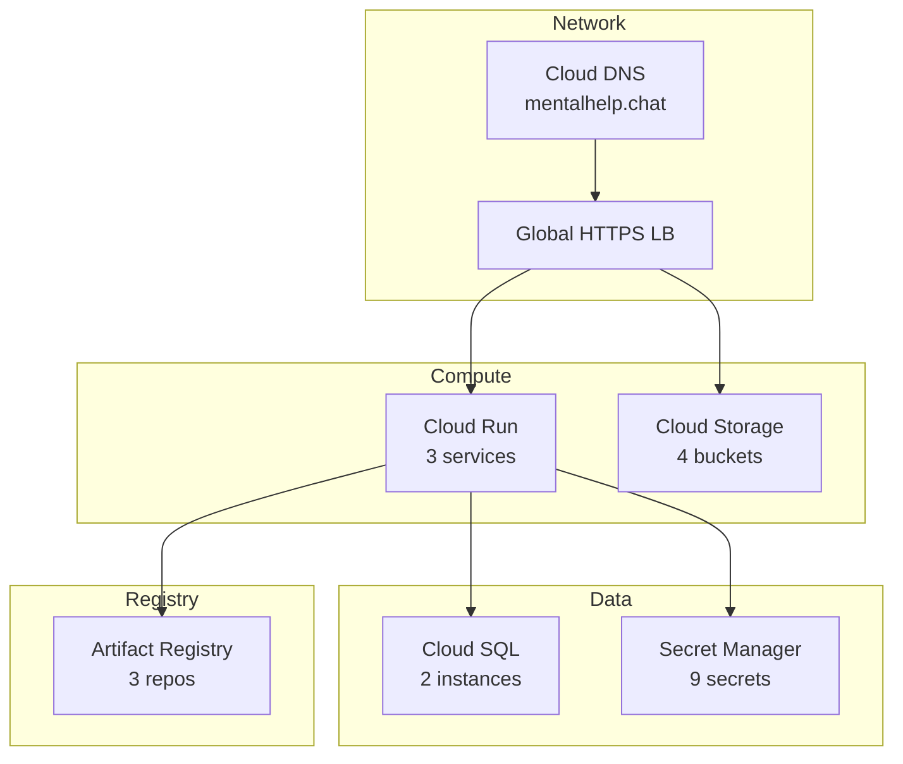

# 4. GCP Infrastructure Inventory

**What this is:** A catalog of all GCP resources in the production project and their relationships.

---

## Cloud Run Services

| Service Name | Region | Public URL | Runtime Service Account | Purpose |
|---|---|---|---|---|
| chat-backend-prod | europe-west1 | https://api.mentalhelp.chat | chat-backend-sa@mental-help-global-25.iam.gserviceaccount.com | Express API serving chat and workbench requests |
| delivery-workbench-backend-prod | europe-west1 | https://api.delivery.mentalhelp.chat | delivery-sa@mental-help-global-25.iam.gserviceaccount.com | Delivery Workbench API |
| mcp-server-prod | europe-west1 | https://mcp.mentalhelp.chat | mcp-sa@mental-help-global-25.iam.gserviceaccount.com | MCP SSE server |

---

## Cloud Storage Buckets

| Bucket Name | Region | Storage Class | Purpose |
|---|---|---|---|
| mentalhelp-chat-frontend-prod | europe-west1 | Standard | chat-frontend static assets |
| mentalhelp-workbench-frontend-prod | europe-west1 | Standard | workbench-frontend static assets |
| mentalhelp-delivery-workbench-frontend-prod | europe-west1 | Standard | delivery-workbench-frontend static assets |
| mentalhelp-cx-state-timeline | europe-west1 | Standard | Dialogflow CX session state persistence |

---

## Cloud SQL Instances

| Instance Name | Region | Tier | Database Version | HA Mode |
|---|---|---|---|---|
| chat-db-prod | europe-west1 | db-f1-micro | PostgreSQL 15 | ZONAL |
| delivery-db-prod | europe-west1 | db-f1-micro | PostgreSQL 15 | ZONAL |

### Databases

| Database | Instance | Purpose |
|---|---|---|
| mentalhelp | chat-db-prod | Primary application database |
| delivery | delivery-db-prod | Delivery Workbench database |

---

## Secret Manager Secrets

| Secret Name | Purpose | Consumers |
|---|---|---|
| DB_PASSWORD-chat-db-prod | Cloud SQL password | chat-backend-prod |
| JWT_SECRET | Session signing | chat-backend-prod |
| DIALOGFLOW_CREDENTIALS | Dialogflow CX auth | chat-backend-prod |
| PKG_TOKEN | GitHub Packages auth | chat-backend-prod, chat-frontend, workbench-frontend |
| NPM_TOKEN | npm publish auth | chat-types, chat-frontend-common |
| REDIS_HOST | Redis connection | chat-backend-prod |
| REDIS_PORT | Redis connection | chat-backend-prod |
| GMAIL_CLIENT_SECRET | Gmail OAuth | chat-backend-prod |
| GMAIL_REFRESH_TOKEN | Gmail OAuth | chat-backend-prod |

---

## Artifact Registry Repositories

| Repository Name | Format | Location | Purpose |
|---|---|---|---|
| chat-images | Docker | europe-west1 | Container images for chat-backend |
| delivery-images | Docker | europe-west1 | Container images for delivery backend |
| mcp-images | Docker | europe-west1 | Container images for MCP server |

---

## Infrastructure Diagram

---

**Last Verified:** 2026-05-08 by Taras Bobrovytskyi
**Regeneration:** Requires gcloud auth (`gcloud run services list`, `gcloud storage ls`, `gcloud sql instances list`, `gcloud secrets list`, `gcloud artifacts repositories list`)
