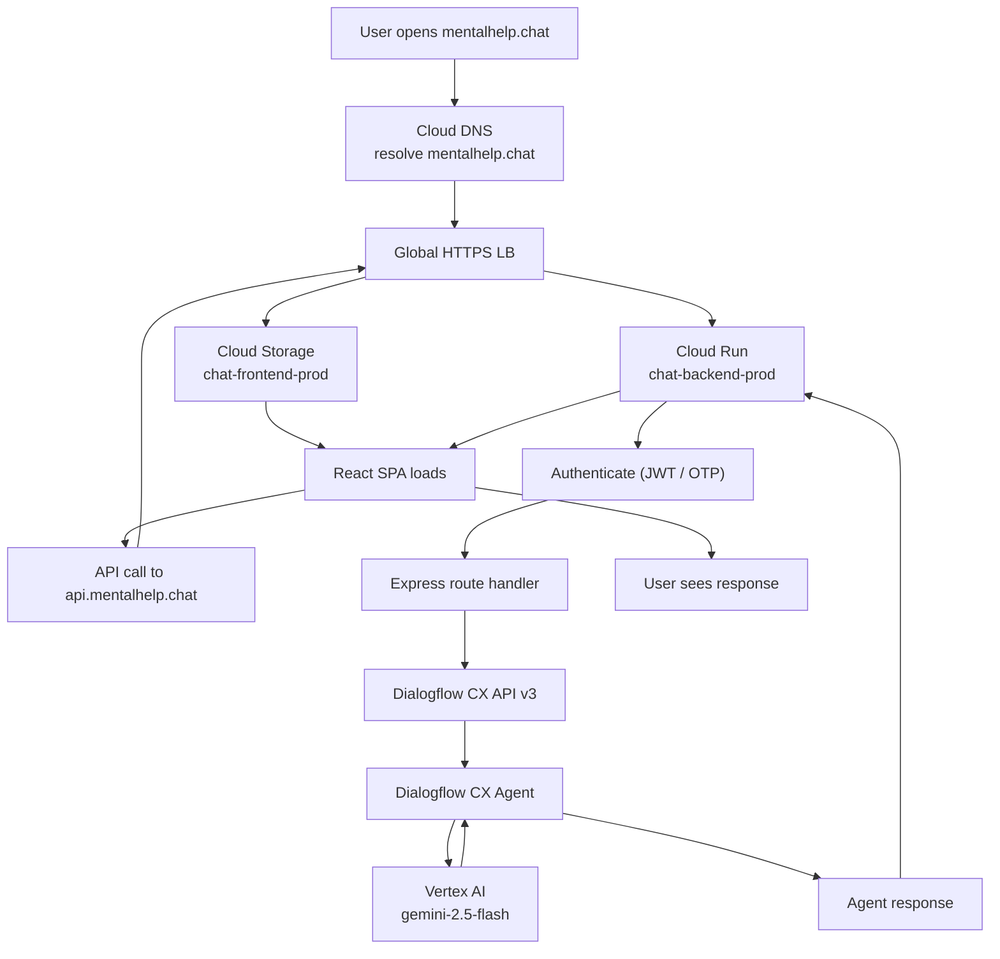
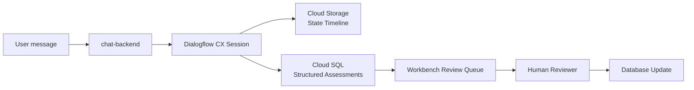
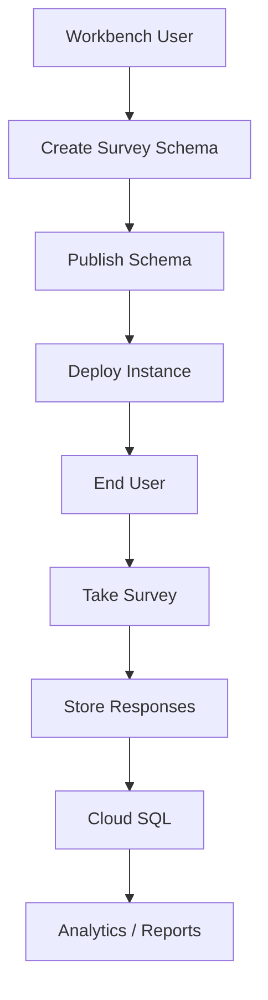

# 5. Data Flow & Integration Map

**What this is:** How a request (and a conversation) moves through the entire system end-to-end.

---

## User Request Flow

---

## Conversation Persistence Flow

---

## Survey Deployment Flow

---

## Integration Points

| From | To | Protocol | Purpose | Auth Method |
|---|---|---|---|---|
| chat-frontend | chat-backend | HTTPS REST | API calls | HTTP-only cookie (JWT) |
| chat-backend | Dialogflow CX | HTTPS REST (v3) | Agent conversation | Service account (WIF) |
| Dialogflow CX | Vertex AI | Internal GCP | LLM inference | Implicit (same project) |
| Dialogflow CX | chat-backend | HTTPS POST | Session-end webhook | No auth (internal) |
| chat-backend | Cloud SQL | TCP (Cloud SQL proxy) | Data persistence | IAM database auth |
| chat-backend | Secret Manager | HTTPS | Secret retrieval | Service account |
| workbench-frontend | chat-backend | HTTPS REST | Admin/review API | HTTP-only cookie (JWT) |
| GitHub Actions | GCP | OIDC (WIF) | Deploy resources | Workload Identity Federation |

---

**Last Verified:** 2026-05-08 by Taras Bobrovytskyi
**Regeneration:** Code inspection of chat-backend routes + Dialogflow CX flow definitions.
