# 7. Database Schema Reference

**What this is:** A comprehensive reference for the production database schema.

---

## Database Overview

| Property | Value |
|---|---|
| Instance | chat-db-prod |
| Engine | PostgreSQL 15 |
| Primary Database | mentalhelp |
| HA Mode | ZONAL |
| Backup Retention | 7 days |

---

## Entity Relationship Diagram

```mermaid
erDiagram
    USERS ||--o{ SESSIONS : has
    USERS ||--o{ GROUP_MEMBERSHIPS : belongs_to
    SESSIONS ||--o{ SESSION_MESSAGES : contains
    SESSIONS ||--o{ SESSION_REVIEWS : reviewed
    SESSIONS ||--o{ SESSION_TAGS : tagged
    SESSIONS ||--o{ RISK_FLAGS : flagged
    SESSIONS ||--o{ ANONYMOUS_MAPPINGS : mapped
    SESSION_MESSAGES ||--o{ MESSAGE_RATINGS : rated
    SESSION_MESSAGES ||--o{ CRITERIA_FEEDBACK : evaluated
    GROUPS ||--o{ GROUP_MEMBERSHIPS : has
    GROUPS ||--o{ GROUP_INVITE_CODES : generates
    GROUPS ||--o{ GROUP_REVIEW_CONFIG : configures
    TAGS ||--o{ SESSION_TAGS : applied_to
    TAGS ||--o{ USER_TAGS : assigned
    SURVEY_SCHEMAS ||--o{ SURVEY_INSTANCES : deployed_as
    SURVEY_INSTANCES ||--o{ SURVEY_RESPONSES : collects
    COHORTS ||--o{ COHORT_MEMBERSHIPS : has
    COHORTS ||--o{ SUPERVISOR_COHORT_ASSIGNMENTS : assigned
    ASSESSMENT_SESSIONS ||--o{ ASSESSMENT_ITEMS : contains
    ASSESSMENT_ITEMS ||--o{ ASSESSMENT_SCORES : scored
    EXPERT_TAG_ASSIGNMENTS ||--o{ EXPERT_ASSESSMENTS : evaluates
    REVIEW_CLINICAL_TAGS ||--o{ REVIEW_CLINICAL_TAG_COMMENTS : commented
    PERMISSIONS ||--o{ PERMISSION_ASSIGNMENTS : granted
    PRINCIPAL_GROUPS ||--o{ PRINCIPAL_GROUP_MEMBERS : has
    TOTP_ENROLLMENTS ||--o{ TOTP_RECOVERY_CODES : has
    AGENT_RUNS ||--o{ AGENT_RUN_SCHEDULES : scheduled
    SYNTHETIC_AGENTS ||--o{ AGENT_RUNS : executes
```

---

## Schema by Domain

### Auth & Identity

| Table | Purpose |
|---|---|
| users | Registered users and their authentication state |
| anonymous_mappings | Pseudonymous ID mappings for guest sessions |
| totp_enrollments | TOTP 2FA enrollments |
| totp_recovery_codes | TOTP recovery codes |
| consent_records | GDPR consent tracking |

### Chat & Sessions

| Table | Purpose |
|---|---|
| sessions | Active chat sessions |
| session_messages | Individual chat messages (user and assistant) |
| session_tags | Tags applied to sessions |
| session_exclusions | Sessions excluded from review |
| settings | Application-wide settings |

### Reviews & Quality

| Table | Purpose |
|---|---|
| session_reviews | Human review records for sessions |
| message_ratings | Ratings given to individual messages |
| criteria_feedback | Structured feedback on review criteria |
| review_configuration | Review workflow configuration |
| review_notifications | Notifications sent to reviewers |
| review_tag_assignments | Clinical tags assigned during review |
| review_message_tag_comments | Comments on message tags |
| review_clinical_tags | Clinical tag definitions |
| review_clinical_tag_comments | Comments on clinical tags |
| expert_tag_assignments | Expert reviewer tag assignments |
| expert_assessments | Expert assessment records |
| grade_descriptions | Grading scale definitions |
| supervision_reports | Supervisor review reports |
| supervisor_reviews | Supervisor review actions |

### Safety & Risk

| Table | Purpose |
|---|---|
| risk_flags | Safety risk flags on sessions |
| risk_thresholds | Configured risk thresholds |
| crisis_keywords | Keywords triggering crisis protocols |
| safety_flag_audit_events | Audit trail for safety flags |
| deanonymization_requests | Requests to deanonymize sessions |
| incorrect_answers | Incorrect assistant responses flagged |

### Users & Groups

| Table | Purpose |
|---|---|
| groups | User groups / spaces |
| group_memberships | Group membership records |
| group_invite_codes | Invitation codes for groups |
| group_review_config | Per-group review configuration |
| group_survey_order | Survey ordering within groups |
| user_tags | Tags assigned to users |
| tags | Tag definitions |
| tag_definitions | Extended tag metadata |

### Surveys

| Table | Purpose |
|---|---|
| survey_schemas | Survey definition and question structure |
| survey_instances | Deployed survey instances |
| survey_responses | Individual user responses |

### CX Assessments

| Table | Purpose |
|---|---|
| assessment_sessions | Dialogflow CX assessment sessions |
| assessment_items | Individual assessment questions |
| assessment_scores | Scored assessment results |
| assessment_schedule | Assessment scheduling |

### Analytics

| Table | Purpose |
|---|---|
| analytics_events | Analytics event tracking |
| sampling_runs | Review sampling runs |
| notifications | System notifications |

### Synthetic Agents

| Table | Purpose |
|---|---|
| synthetic_agents | Synthetic conversation agent definitions |
| agent_runs | Agent execution runs |
| agent_run_schedules | Agent run schedules |
| cohorts | Test cohorts |
| cohort_memberships | Cohort membership |
| supervisor_cohort_assignments | Supervisor cohort assignments |

### Permissions & Access

| Table | Purpose |
|---|---|
| permissions | Permission definitions |
| permission_assignments | Permission grants |
| principal_groups | Principal group definitions |
| principal_group_members | Principal group members |

### GDPR & Privacy

| Table | Purpose |
|---|---|
| gdpr_audit_log | GDPR audit events |
| erasure_jobs | Data erasure job tracking |
| used_action_tokens | Consumed action tokens |

### Change Management

| Table | Purpose |
|---|---|
| change_requests | Change request tracking |
| audit_log | General audit log |
| annotations | Manual annotations on sessions/messages |

---

## Per-Table Reference

### sessions

| Column | Type | Nullable | Default | Constraints |
|---|---|---|---|---|
| id | UUID | NO | gen_random_uuid() | PRIMARY KEY |
| user_id | UUID | YES | — | FOREIGN KEY → users.id |
| status | VARCHAR | NO | 'active' | — |
| dialogflow_session_id | VARCHAR | YES | — | INDEX |
| started_at | TIMESTAMP | NO | now() | INDEX |
| last_activity_at | TIMESTAMP | NO | now() | INDEX |
| created_at | TIMESTAMP | NO | now() | — |
| updated_at | TIMESTAMP | NO | now() | — |
| moderation_status | VARCHAR | YES | — | INDEX |
| guest_id | UUID | YES | — | INDEX |

### session_messages

| Column | Type | Nullable | Default | Constraints |
|---|---|---|---|---|
| id | UUID | NO | gen_random_uuid() | PRIMARY KEY |
| session_id | UUID | NO | — | FOREIGN KEY → sessions.id, INDEX |
| role | VARCHAR | NO | — | — |
| content | TEXT | NO | — | — |
| timestamp | TIMESTAMP | NO | now() | INDEX |
| created_at | TIMESTAMP | NO | now() | INDEX |

### users

| Column | Type | Nullable | Default | Constraints |
|---|---|---|---|---|
| id | UUID | NO | gen_random_uuid() | PRIMARY KEY |
| email | VARCHAR(255) | NO | — | UNIQUE |
| phone | VARCHAR(50) | YES | — | — |
| role | VARCHAR | NO | 'user' | — |
| created_at | TIMESTAMP | NO | now() | — |
| updated_at | TIMESTAMP | NO | now() | — |

### groups

| Column | Type | Nullable | Default | Constraints |
|---|---|---|---|---|
| id | UUID | NO | gen_random_uuid() | PRIMARY KEY |
| name | VARCHAR(255) | NO | — | INDEX |
| created_at | TIMESTAMP | NO | now() | — |
| updated_at | TIMESTAMP | NO | now() | — |

### survey_schemas

| Column | Type | Nullable | Default | Constraints |
|---|---|---|---|---|
| id | UUID | NO | gen_random_uuid() | PRIMARY KEY |
| title | VARCHAR(255) | NO | — | — |
| schema | JSONB | NO | — | — |
| created_at | TIMESTAMP | NO | now() | — |
| updated_at | TIMESTAMP | NO | now() | — |

### risk_flags

| Column | Type | Nullable | Default | Constraints |
|---|---|---|---|---|
| id | UUID | NO | gen_random_uuid() | PRIMARY KEY |
| session_id | UUID | NO | — | FOREIGN KEY → sessions.id |
| severity | VARCHAR | NO | — | — |
| reason | TEXT | NO | — | — |
| created_at | TIMESTAMP | NO | now() | — |

---

## Cross-Reference: Service → Tables

| Service | Tables Written |
|---|---|
| chat-backend | sessions, session_messages, users, groups, group_memberships, survey_schemas, survey_instances, survey_responses, risk_flags, session_reviews, tags, session_tags |
| Dialogflow CX webhook | assessment_sessions, assessment_items, assessment_scores |
| Workbench | review_configuration, review_notifications, expert_tag_assignments, expert_assessments, review_clinical_tags, review_clinical_tag_comments |
| Synthetic agents | synthetic_agents, agent_runs, agent_run_schedules, cohorts, cohort_memberships |

---

**Last Verified:** 2026-05-08 by Taras Bobrovytskyi
**Regeneration:** Inspect chat-backend migration files (`src/db/migrations/*.sql`)
